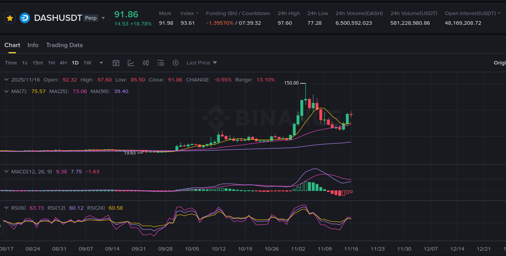

# Что такое funding (фандинг)?

- [гайд от Binance](https://www.binance.com/en/support/faq/detail/360033525031)

**Funding** — это периодический платеж между участниками **бессрочных фьючерсов (perpetual)**. Он нужен, чтобы **«сравнить» и удерживать рядом** цену перпа и **цену спота**: когда перп уходит слишком высоко/низко относительно спота, фандинг стимулирует трейдеров занимать противоположную сторону и возвращает цену ближе к споту.

### Кто кому платит

- **Funding \(+\)**: перп торгуется **дороже** спота → **лонги платят шортам**
- **Funding \(-\)**: перп торгуется **дешевле** спота → **шорты платят лонгам**

### Пример

Разберём на `DASH/USDT Perpetual`. Если funding сейчас `-1.39570%`, то на ближайший расчёт (часто раз в 8 часов, зависит от биржи) **шорты заплатят лонгам**.

- Если у шортиста `1000$ margin`, то платёж будет `1000 * 0.0139570 = 13.9570$`
- Если funding станет `+1.39570%`, ситуация будет наоборот: **лонги заплатят шортам**

### Как это использовать

- **Большой по модулю funding** обычно означает перекос и «переполненную» сторону (слишком много лонгов или шортов).
- В такие моменты входы **могут быть рискованнее**, потому что рынок часто становится более чувствительным к резким движениям и ликвидациям. Иногда разумнее переждать, пока funding нормализуется.
