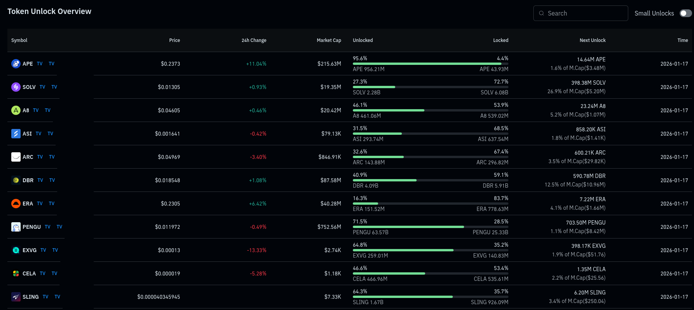

> https://www.coinglass.com/token-unlock

## Token Unlock (Разблокировка токенов)

**Token Unlock** - это процесс, при котором ранее заблокированные токены проекта становятся доступными для обращения (продажи, перевода, торговли) согласно заранее заданному графику (vesting schedule).

Обычно токены блокируются для:

- команды проекта
- ранних инвесторов / фондов
- advisors
- экосистемы и резервов

Цель блокировки - предотвратить мгновенный слив токенов после запуска проекта.

## Основные показатели Token Unlock

### 🔓 Unlocked Supply

Количество и процент токенов, которые **уже находятся в обращении** и могут свободно продаваться.

> Низкий процент unlocked означает, что большая часть токенов ещё не вышла на рынок.

---

### 🔒 Locked Supply

Количество и процент токенов, которые **ещё заблокированы** и будут выпущены в будущем.

> Высокий locked supply = потенциальное будущее давление на цену.

---

### 📅 Next Unlock

Ближайшее событие разблокировки:

- сколько токенов будет разблокировано
- какую долю от текущей рыночной капитализации это составляет

Часто указывается в виде:

- количества токенов
- процента от Market Cap

## Как использовать Token Unlock в анализе и трейдинге

### ⚠️ Оценка риска дампа

- Большие unlock'и → высокий риск падения цены
- Особенно опасно, если:
  - низкая ликвидность
  - слабый спрос
  - медвежий рынок

---

### 📉 Торговля вокруг unlock'ов

Типичные сценарии:

- Цена падает **до unlock'а** (рынок закладывает риск заранее)
- Резкий слив **в день unlock'а**
- Иногда - отскок после unlock'а, если событие было «ожидаемым»

---

### 🧠 Фильтрация проектов

При выборе токенов стоит учитывать:

- Unlocked supply > 50% - более стабильная токеномика
- Unlocked supply < 30% - высокий инфляционный риск
- Next unlock < 2–3% от Market Cap - умеренный риск
- Next unlock > 10–15% от Market Cap - высокий риск

## Вывод

Token Unlock - один из ключевых факторов давления на цену токена.
Игнорирование графика разблокировок часто приводит к неожиданным просадкам, даже при сильных фундаментальных новостях.

Перед покупкой токена **всегда проверяй**:

- процент unlocked
- график vesting
- размер ближайших unlock'ов
