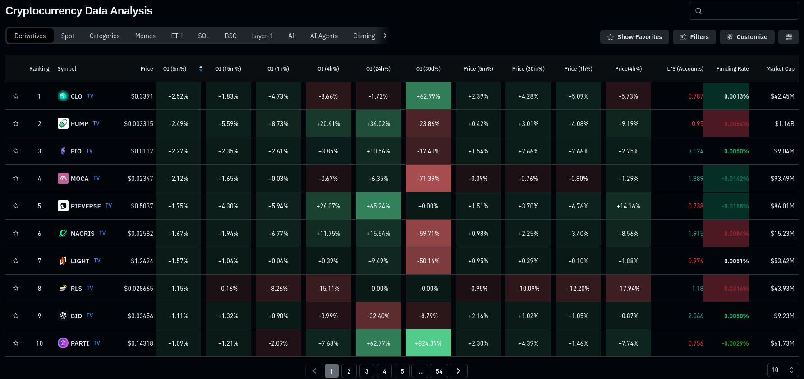
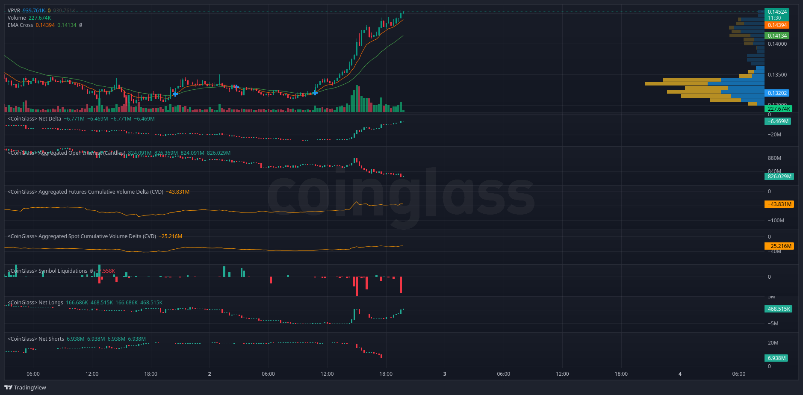
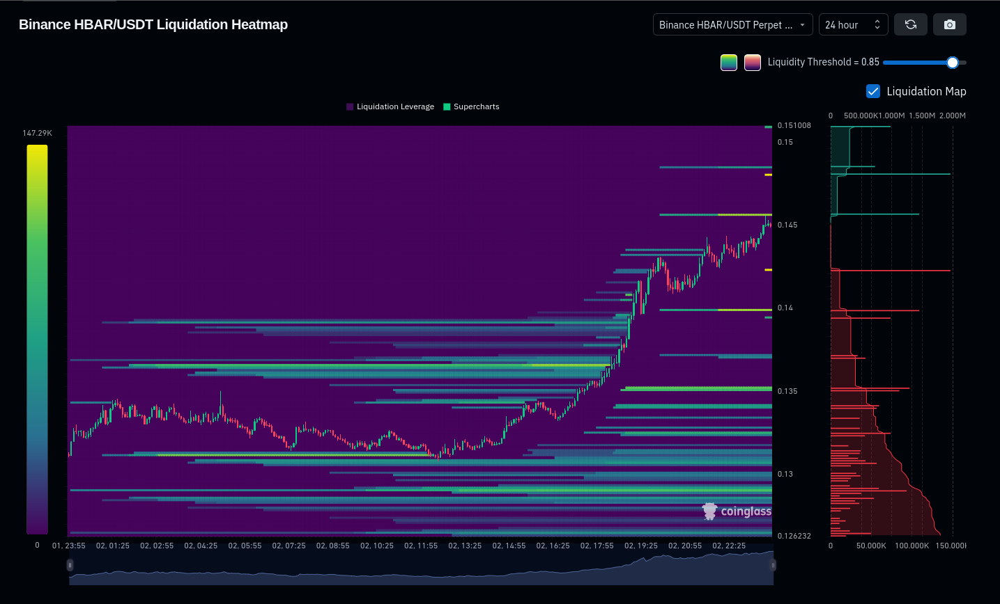

### Выбор альтов

- Заходим в [coinglass](https://coinglass.com)
- Сортируем по Open Interest например за 5 минут

- Чекаем монетки, используем эти индикаторы
  - Основной Chart
    - Volume Profile Visible Range (VPVR)
    - Volume
    - EMA Cross
  - Дополнительно
    - Net Delta
    - Aggregated Open Interest (Candles)
    - Aggregated Futures Cumulative Volume Delta (CVD)
    - Aggregated Spot Cumulative Volume Delta (CVD)
    - Symbol Liquidations
    - Net Longs
    - Net Shorts

- Обязательно проверяем Liquidations HeatMap

- Вроде все, анализуем в совопкупности все индикаторы и открываем/фиксируем позиции в ключевых точках по `ликвидациям | уровням | EMA Cross`
