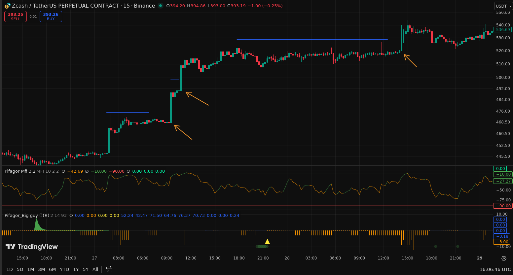

- Смотрим на монеты у которых цена уже формировала уровни и пробивала их с объемами
- обычно такие пробои импульсные и кратковременные, отрабатывают в рамках нескольких минут
- такие импульсы - охота на шортистов, которые поставили стопы чуть сверху уровня
- тоже самое работает и в другую сторону, могут пробивать уровни с стопами лонгов

- заходим всегда с стопом за линией поддержки
- выходим когда импульс угас и цена начинает флетить, скорее всего будет разворот оттуда

 

#### видео референс

- https://www.youtube.com/watch?v=4VENXOjhmi0
