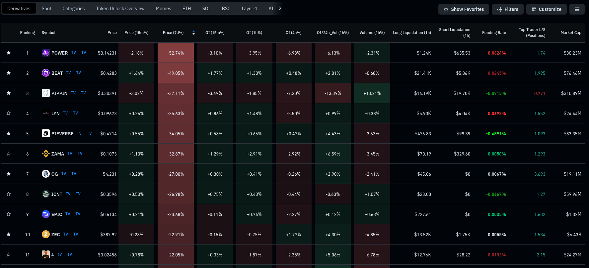
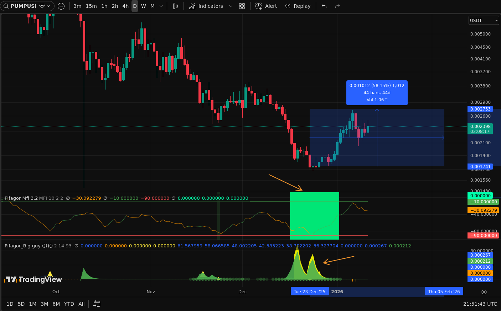
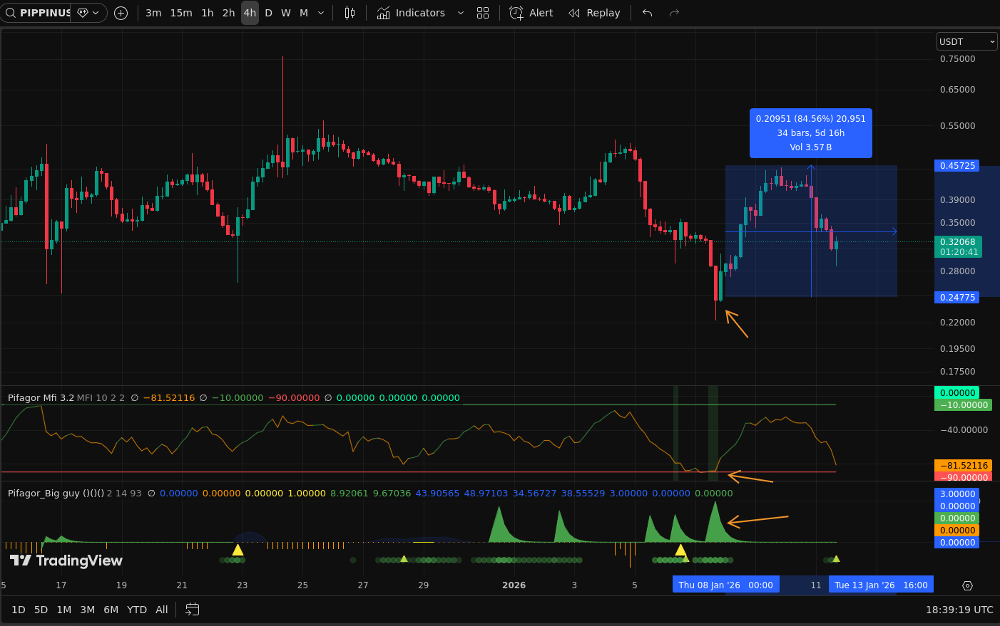
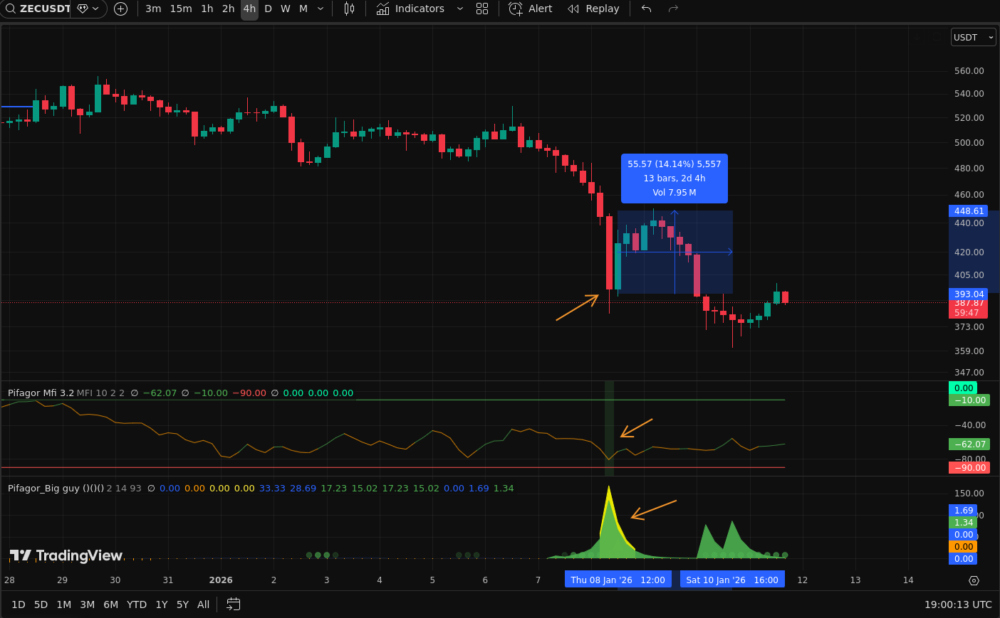
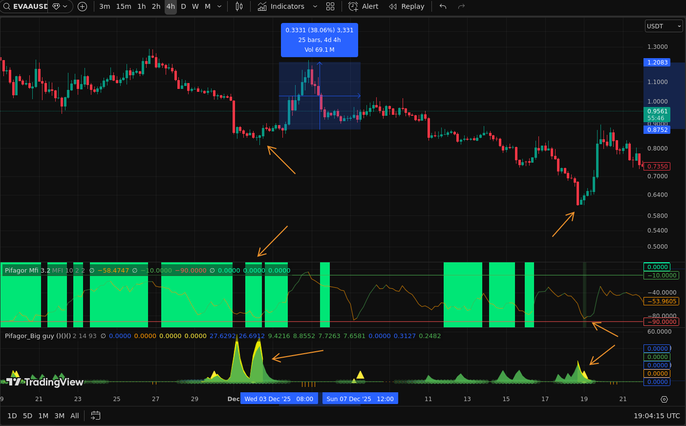
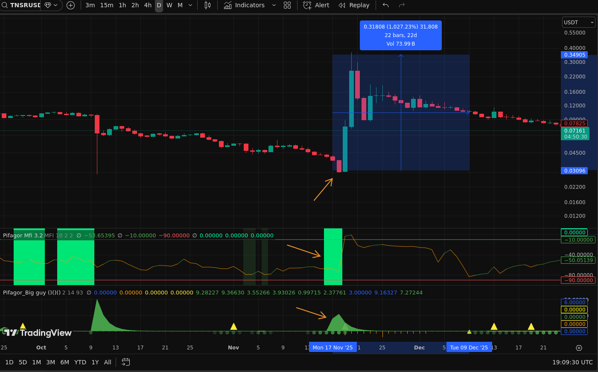
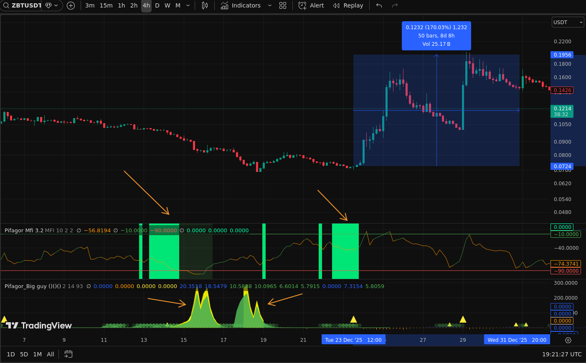
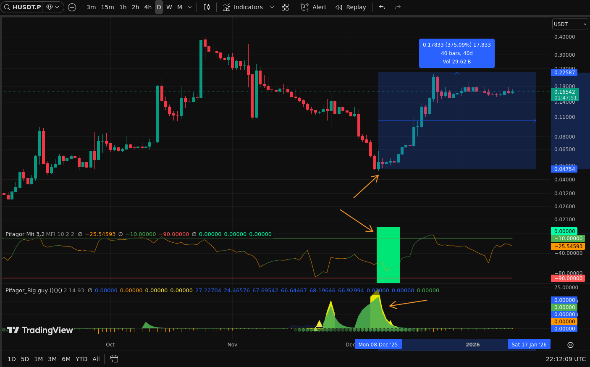

## Ищем монеты

- которые очень сильно упали в течении 7 дней

- нам интерсуют жесткие сливы, где очень сильно откупают
- на альтах лучше всего использовать 4ч таймфрейм, еще лучше - 1д
- цели `~50-200%` чистого движения или больше
- если фандинг больше `-1%` - оставляем и фармим и его тоже :)
- как всегда заходим на 1-2% от депо
- при необходимости усредняем если цена упала еще сильнее `~30-50%` и сново появились большие откупы

## Что означают индикаторы?

- `MFI` растет/падает - заходят/уходят деньги
  - `LONG` когда он растет начиная с линии поддержки
  - `SHORT` когда он падает начиная с линии сопротивления
- `Big Guy` чем больше "гора" тем больше денег крупный игрок заносит

> для получения - [@Pifagor_Indicator_bot](https://t.me/Pifagor_Indicator_bot)

## Примеры

#### PIPPIN/USDT

#### ZEC/USDT

#### EVAA/USDT

#### TNSR/USDT

#### ZBT/USDT

#### H/USDT

